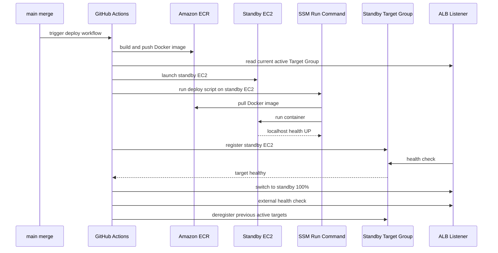

 # JobRadar 🎯

> 개발자 취업준비생을 위한 채용공고 통합 검색 및 분석 대시보드

개발 직군 취업 준비 중 여러 채용 플랫폼을 번갈아 확인해야 하는 불편함을 해결하기 위해 개발했습니다. 사람인·잡코리아의 채용 공고를 통합 검색할 수 있으며, AI 공고 요약, 채용 트렌드 대시보드, 스크랩 및 지원 상태 관리 기능을 제공합니다.

**🌐 https://jobradar.me**

테스트 계정: `test@jobradar.com` / `test1234`

<br>

<details>
 <summary> 📋 Version History</summary>

### v1.0.3 (2026-06-03)
 -  [fix] API 중복 호출 및 캐시 스탬피드 방어 로직 작성

### v1.0.2 (2026-06-02)
- [fix] N+1 문제 해결

### v1.0.1 (2026-05-24)
- [chore] favicon 디자인 변경 및 브라우저/기기별 대응 추가
  - SVG, ICO, PNG 멀티포맷 적용
  - iOS 홈 화면, Android PWA 아이콘 지원
  - site.webmanifest 설정 (theme_color: #378ADD)

### v1.0.0 (2026-05-23)
- 첫 번째 릴리즈
  
</details>

<details>
 <summary>🛠 사용 기술</summary>
 
### Backend


### Frontend


### Infrastructure


[](https://coderabbit.ai)

</details>

<details>
 <summary>📸 주요 기능</summary>

| 통합검색 | AI공고 요약 | 채용 트렌드 | 스크랩 |
| :---: | :---: | :---: | :---: |
|  |  |  |  |


### 1. 채용공고 통합 검색
- 사람인·잡코리아 개발 직군 공고를 한 곳에서 검색 (06/03 기준 활성 공고 수 30,000건, 매일 업데이트)
- 직무 / 지역 / 경력 / 기술스택 복합 필터링
- 키워드 검색 + 드롭다운 멀티필터

### 2. AI 채용공고 요약
- 긴 공고 본문을 핵심만 추려 한눈에 파악
- 주요 업무, 자격 요건, 우대 사항을 카테고리별로 분류

### 3. 채용 트렌드 대시보드
- 최신 수집 데이터를 기준으로 전체 / 신규 / 마감 임박 / 신입 공고 통계 제공
- 기술스택 수요 순위 (상위 8개 기술스택)
- 지역별 채용 비중 (상위 10개 지역)
- 경력별 공고 분포 (신입 / 1\~3년 / 3\~5년 / 5년+)

### 4. 스크랩 + 지원 현황 관리
- 관심 공고 스크랩
- 4단계 지원 상태 관리: 지원예정 → 지원완료 → 서류검토 → 결과
- 상태별 필터링으로 지원 현황 한눈에 파악

</details>

<details>
 <summary>🗄 ERD</summary>
 


</details>

<details>
 <summary>🏗 아키텍처</summary>

[](/jobRadar_arch.svg?v=1)

</details>

<br>

## 📌 Description
1. [로그인 방식(Session vs JWT)](#1-로그인-방식-결정session-vs-jwt)
2. [데이터 수집 방식(웹크롤링 VS 공식 API)](#2-데이터-수집-방식웹크롤링-vs-공식-api)
3. [인덱스를 통한 쿼리 성능 개선](#3-인덱스를-통한-쿼리-성능-개선)
4. [DB부하 감소를 위한 캐싱 적용](#4-db부하-감소를-위한-캐싱-적용)
5. [N+1 문제 해결](#5-n1-문제-해결)
6. [lock 을 이용한 동시성 제어](#6-lock-을-이용한-동시성-제어)
7. [운영 환경 타임존 불일치 해결](#7-운영-환경-타임존-불일치-해결)
8. [Blue/Gren 무중단 배포](#8-bluegreen-무중단-배포)

<br>


## 💡 의사결정 과정

### 1. 로그인 방식 결정(Session vs JWT)

#### 1-1. 세션과 JWT 비교

* 세션 방식은 서버 측 저장소에서 인증 상태를 관리합니다. 구현이 직관적이고 서버 측에서 세션을 즉시 무효화할 수 있다는 장점이 있습니다. 다만 여러 서버 인스턴스로 확장할 경우 Redis와 같은 공용 저장소를 사용해서 세션 클러스터링을 구성해야 합니다.

* JWT 방식은 Access Token 자체에 인증 정보를 포함하므로, 서버가 매 요청마다 세션 상태를 조회하지 않아도 됩니다. 여러 서버 인스턴스에서 동일한 인증 로직을 처리하기 쉽다는 장점이 있습니다. 다만 Access Token이 탈취되면 만료되기 전까지 즉시 무효화하기 어렵다는 한계가 있습니다.

#### 1-2. JWT 채택과 이유

다음 사항을 고려하여 JWT 기반 인증을 선택했습니다.

* 프론트엔드와 백엔드가 분리된 환경에서 인증 정보를 전달하기 용이함
* 향후 애플리케이션 서버 확장 시 Access Token 검증을 각 인스턴스에서 처리할 수 있음
* Refresh Token을 Redis에 저장하여 재발급과 로그아웃 처리를 관리할 수 있음

---
<br>

### 2. 데이터 수집 방식(웹크롤링 VS 공식 API)

#### 2-1. 문제
성능과 안정성을 고려하여 공식 API를 사용하려 했으나, 잡코리아는 개인 대상 API를 미지원하며, 사람인은 발급 신청이 승인되지 않아 부득이하게 웹 크롤링 방식을 채택하였습니다

#### 2-2. 웹 크롤링 방식(jsoup vs Playwright)
* 정적 웹페이지 크롤링(jsoup) 방식은 서버에서 정적인 HTML받아서 데이터를 파싱합니다. 단순 HTML문서를 받아서 파싱하기 때문에 속도가 빠르고 리소스 소모가 적습니다.
* 동적 웹페이지 크롤링(Playwright)은 실제로 브라우저를 구동하여 JavaScript 렌더링이 완료된 후의 데이터를 수집합니다. 화면 클릭, 스크롤 등 사용자 상호작용이 필요한 동적 웹사이트 수집이 가능하지만 리소스 소모가 크고 상대적으로 속도가 느립니다.

#### 2-3. jsoup 채택과 이유
* 네트워크 탭을 분석한 결과, 사람인은 SSR(서버 사이드 렌더링) 방식으로 HTML을 응답하고 있었으며, 잡코리아는 SSR과 AJAX Partial Update 패턴을 혼용하여 사용 중인 것을 확인했습니다.
* 두 사이트 모두 요청 시 HTML을 반환하고 있었기 때문에, 오버헤드가 큰 동적 크롤링 대신 설정이 직관적이고 가벼운 jsoup을 선택하여 수집 속도와 효율을 높였습니다.

<small>*※ 대상 웹사이트의 `robots.txt`를 준수하였으며, 서버 부하를 최소화하기 위해 요청 간격에 최소 1초 이상의 대기 시간을 두었습니다.*</small>

---
<br>

### 3. 인덱스를 통한 쿼리 성능 개선
공고 데이터가 늘어날 수록 집계 쿼리에서 병목이 발생할 것이라고 생각했습니다. `EXPLAIN`을 통해 실행계획을 분석하고 병목지점을 파악 및 개선했습니다.

#### 3-1. 문제
* `/api/stats/today` (전체, 신규, 마감임박, 신입 공고 집계 처리) 에서 `Full Table Scan`이 발생하고 있었습니다.

#### 3-2. 인덱스 추가
* `Full Table Scan`을 제거하기 위해 동등 조건으로 사용되는 status를 선행 컬럼으로, 범위 조건으로 사용되는 deadline을 후행 컬럼으로 구성한 복합 인덱스를 적용했습니다.

#### 3-3. 성능 테스트
* 부하 테스트를 통해 인덱스 추가 후 성능이 얼마나 향상되었는지 측정했습니다.
* 테스트 도구는 JavaScript 기반으로 시나리오 코드의 가독성이 좋고, 적은 리소스로도 대규모 동시 접속 부하를 안정적으로 발생시킬 수 있는 `K6`를 사용했습니다.
* 테스트 진행과정

  a. 대용량 더미데이터 구축
     * 유의미한 인덱스 성능을 측정하기 위해 `Procedure`를 작성하여 10만 건의 더미데이터를 `Bulk Insert`했습니다.
  
  b. 테스트 시나리오 설정
     * 실제 트래픽이 몰리는 상황을 가정하여 총 100명의 가상 유저(VUs)가 통계 API를 집중적으로 호출하도록 시나리오를 구성했습니다.
       * Ramp-up: 20초 동안 0명에서 100명으로 점진적 증가
       * Peak: 30초 동안 100명 유지 (최대 부하 발생 구간)
       * Ramp-down: 10초 동안 0명으로 감소
     * 테스트 스크립트:
       ```javascript
       export const options = {
         stages: [
           { duration: "20s", target: 100 }, // 20초 동안 가상 유저(VU)를 0명에서 100명까지 점진적 증가
           { duration: "30s", target: 100 }, // 30초 동안 가상 유저 100명 유지 (피크 트래픽)
           { duration: "10s", target: 0 }, // 10초 동안 가상 유저를 100명으로 감소시키며 마무리
         ],
         thresholds: {
           http_req_failed: ["rate<0.01"], // 에러율이 1% 미만이어야 테스트 통과
           http_req_duration: ["p(95)<500"], // 전체 요청의 95%는 0.5초(500ms) 이내에 응답해야 함
         },
       };
       ```

  c. 테스트 수행
     * 인덱스 생성 전 쿼리로 테스트를 수행합니다.

  d. 인덱스 생성 후 테스트 수행
     * 인덱스 생성 후 동일한 조건으로 테스트를 수행합니다.

  e. 결과 비교
     * 인덱스 생성 전후의 측정 결과를 비교하여 유의미한 성능 향상이 있었는지 평가합니다.
 
 #### 3-4. 결과
* 복합 인덱스 적용 결과, 4개 쿼리 모두 실행 계획의 접근 방식이 ALL에서 range로 변경되었으며, 예상 검사 행 수가 감소했습니다.
* `/api/stats/today` 의 평균 응답시간이 36% 단축되었습니다.
* 대표 집계 쿼리 (전체 공고 수)
  ```SQL
  SELECT COUNT(id)
    FROM job_posts
   WHERE status = 'ACTIVE'
     AND (deadline IS NULL OR deadline >= CURDATE());
  ```
  
 * 실행 계획(EXPLAIN) 비교
   * 인덱스 추가 전
     
   * 인덱스 추가 후
     
     
* 성능 향상 지표 (/api/stats/today)
   | 측정 지표 | 개선 전 | 개선 후 | 성능 개선 효과 |
   | :--- | :--- | :--- | :--- |   
   | 평균 응답 (Avg) | 3,395.02 ms | 2,171.53 ms |  약 36% 단축 |
   | 초당 처리량 (RPS)| 17.55 req/s | 24.05 req/s |  약 37% 증가 |

---
<br>

### 4. DB부하 감소를 위한 캐싱 적용

통계 집계 연산으로 인한 DB 부하를 해결하기 위해 캐시 도입을 결정했습니다. 본 서비스는 매일 1회 스케줄러 기반의 크롤링으로 데이터가 갱신되기 때문에, 하루 단위로 데이터의 상태가 고정되는 특징이 있습니다. 이를 활용하면 캐시 불일치 문제에 대한 부담 없이 높은 캐시 히트율을 달성할 수 있어 캐싱 도입에 최적화된 조건이라 판단했습니다.

#### 4-1. 캐시 저장소 선택

캐시 저장소로 Memcached와 Redis를 비교했습니다.

* Memcached는 단순한 Key-Value 캐시에 적합하고 멀티스레드를 지원한다는 장점이 있습니다.
* Redis는 다양한 자료 구조를 제공하고, Spring Cache 및 Redisson과 연동하기 용이합니다.

#### 4-2. Redis 선택과 이유

본 프로젝트에서는 Refresh Token 저장을 위해 이미 Redis를 사용하고 있습니다. 별도의 캐시 저장소를 추가하기보다 기존 Redis를 활용하면 인프라 구성을 단순하게 유지할 수 있습니다.

또한 캐시 만료 직후 발생할 수 있는 Cache Stampede를 방어하기 위해 Redisson 기반 분산 락을 적용할 수 있다는 점도 고려했습니다.

#### 4-3. 데이터 정합성 유지 (TTL 및 갱신)
캐시 데이터와 원본 DB 간의 불일치(Stale Data)를 최소화하고, 동시에 서버 부하를 방어하기 위해 다음과 같은 전략을 취했습니다.

* **TTL(Time-To-Live) 설정:** 하루에 한번 데이터가 업데이트되는 서비스 특성상 모든 통계 캐시 의 만료 시간(TTL)은 24시간으로 설정했습니다.
* **Cache Invalidation (Eviction):** 크롤링이 완료되고 데이터가 업데이트 된 후 `@CacheEvict` 를 사용해서 Flush 했습니다.

#### 4-4. Cache Stampede 방어
크롤링 직후 캐시가 비워진 상태에서 순간적으로 트래픽이 몰릴 경우, 다수의 요청이 동시에 DB를 조회하고 캐시를 갱신하는 Cache Stampede 현상이 발생할 수 있습니다. 이를 방지하기 위해 락(Lock) 메커니즘 도입을 고려했습니다.

* **redisson**: Redis를 기반으로 분산 락을 제공하는 라이브러리입니다. 여러 서버 인스턴스가 동일한 캐시 키 또는 공고 ID에 대한 작업을 동시에 수행하지 않도록 제어할 수 있습니다.
* **@Cacheable(sync = true)**: `Spring Cache`가 제공하는 기능으로, '동일한 캐시 키'를 요청하는 스레드에 대해 동기화를 보장합니다. JVM 메모리 내부에서 작동하는 로컬 락 방식으로 동작합니다

`@Cacheable(sync = true)`는 구현이 간결하나 추후 서버 확장이 일어났을 때 다중 인스턴스 환경을 대응하기 어렵다고 판단했습니다. 따라서 확장성을 고려해 Redis를 공유 저장소로 사용하는 Redisson 분산 락을 적용했습니다.

#### 4-5. 결과

캐시 계층 도입 후 동일한 [성능 테스트(100 VUs)](#3-3-성능-테스트)를 수행했습니다.

`Grafana` 와 `Prometheus` 를 사용해서 `DB Connetion pool`의 변화를 확인해 보았습니다.

* 캐시 적용 전


* 캐시 적용 후


* 성능 향상 지표

| 측정 지표 | 캐시 적용 전 | 캐시 적용 후 | 성능 개선 효과 |
| :--- | :--- | :--- | :--- |
| 평균 응답 (Avg) | 2,471.44 ms | 5.41 ms | 약 99.8% 단축 |
| 초당 처리량 (RPS)| 21.90 req/s | 75.24 req/s | 약 244% 증가 |

---
<br>

### 5. N+1 문제 해결

**문제**

스크랩 목록 조회(`/api/scraps`)와 공고목록 조회(`/api/jobs`)에서 N+1 문제를 확인했습니다.

**5-1. 스크랩 목록 조회**

**원인**

Scrap과 Job은 ManyToOne 관계로 연결되어 있습니다. 스크랩 목록을 조회한 뒤 각 공고 정보에 접근하면 추가 SELECT 쿼리가 반복적으로 발생했습니다.

**해결과정**

* N+1문제를 해결하는 방법으로는 `@EntityGraph`와 `Fetch Join`가 있었습니다. 
* `@EntityGraph`는 left outer join 방식으로 작동하지만 현재 엔티티 구조상 문제가 없다고 판단했습니다. 가독성이 좀더 좋은 `@EntityGraph`을 선택했고 Eager Loading방식으로 데이터를 로드해서 N+1문제를 해결했습니다.

```java
    /**
     * 사용자 이메일로 전체 스크랩 목록 조회
     */
    @EntityGraph(attributePaths = {"job"})
    List<Scrap> findByUserEmailOrderByCreatedAtDesc(String email);

```

**5-2. 공고목록 조회**

**원인**

`job`과 `techStack` 엔티티가 ManyToMany 관계로 설정되어 있어, `job.getTechStacks()`에 접근할 때마다 추가적인 SELECT 쿼리가 발생하는 N+1 문제가 있었습니다.

**해결과정**

* 처음에는 `@EntityGraph(Fetch Join)`를 사용하여 문제를 해결하려 했으나, 이전보다 눈에 띄게 속도가 느려지고 로그에 HHH90003004: firstResult/maxResults specified with collection fetch; applying in memory라는 경고가 발생하는 것을 확인했습니다.

* 해당 경고는 DB가 아닌 애플리케이션 메모리에서 쿼리 결과를 전부 가져온 뒤 페이징 작업을 수행하기 때문에 OOM(Out of Memory)이 발생할 수 있다는 의미였습니다. 실제로 쿼리 로그에서 LIMIT 절이 사라진 것을 확인했습니다.

* 이는 `@EntityGraph`가 DB 관점에서는 조인(JOIN)이기 때문입니다. 컬렉션을 조인하면 쿼리의 결과 수(Row)가 부풀려집니다. (예: 하나의 공고에 3개의 기술 스택이 있다면 총 3개의 Row가 생성됨). 이 상태에서 LIMIT를 통해 페이징을 적용하면 데이터가 중간에 잘리게 되므로, JPA는 이를 막기 위해 모든 데이터를 메모리에 적재한 뒤 중복을 제거하고 페이징하는 과정을 거칩니다.

* 따라서 대안으로 하이버네이트 공식 문서에서 소개하고 있는 `@BatchSize`를 도입했습니다. `@BatchSize`는 지연 로딩(Lazy Loading) 시 발생하는 단일 쿼리들을 IN 절을 이용해 지정된 크기(Size)만큼 묶어서 한 번에 조회하게 해줍니다.

* 결과적으로 Job의 techStacks 컬렉션에 `@BatchSize(size = 10)`을 적용했습니다. 공고 목록을 페이징하여 먼저 조회한 뒤, 지연 로딩되는 기술 스택 컬렉션을 공고 ID 기준의 `IN` 절로 묶어서 조회하도록 구성했습니다. 이를 통해 컬렉션 Fetch Join 사용 시 발생했던 메모리 페이징 문제를 피하면서, 기술 스택 조회 쿼리가 공고 수만큼 반복되는 N+1 문제를 완화했습니다.

```java
    @ManyToMany(fetch = FetchType.LAZY)
    @BatchSize(size = 10)
    @JoinTable(
            name = "job_post_stacks",
            joinColumns = @JoinColumn(name = "job_post_id"),
            inverseJoinColumns = @JoinColumn(name = "tech_stack_id")
    )
    private List<TechStack> techStacks = new ArrayList<>();
```

---

<br>

### 6. lock 을 이용한 동시성 제어

**문제**

공고 상세 콘텐츠는 사용자가 상세 페이지를 최초로 조회하는 시점에 크롤링으로 수집하고 AI 요약을 생성합니다.
같은 공고에 여러 사용자가 동시에 접근하면, 상세 콘텐츠의 수집 상태가 갱신되기 전에 여러 요청이 외부 API 호출이 필요하다고 판단할 수 있습니다. 이 경우 동일한 공고에 대해 크롤링과 AI API 호출이 중복으로 실행됩니다.

**원인**

DB의 status 값으로 API 호출 여부를 판단합니다.
status값이 업데이트되지 않은 상태에서 여러 스레드가 동시 접근 → api호출 필요로 판단 → 중복 api호출이 발생합니다.

**해결과정**

동일한 공고 ID를 기준으로 하나의 요청만 외부 API를 호출하도록 동시성 제어가 필요했습니다.
spring에서 동시성을 제어하는 방법에 대해 찾아보았습니다.

* 비관적 락 : 트랜젝션 시작시 DB에 직접 락을 거는 방법입니다. 가장 확실하지만 지금처럼 외부 API 호출이 있다면 트래픽이 몰릴경우 DB커넥션풀이 금방 고갈될 수 있기 때문에 적합하지 않다고 생각했습니다.
* 낙관적 락 : 버전을 통해 데이터의 정합성을 확보합니다. update 쿼리실행시 버전을 확인하고 버전이 맞지않는다면 exception을 발생시킵니다. 현재 데이터 정합성이 아니라 api의 중복호출이 문제이기 때문에 적합하지 않습니다.
* synchronized : Java에서 제공하는 동기화 기능입니다. 동일 JVM 내부에서는 간단하게 중복 실행을 제어할 수 있지만, 여러 서버 인스턴스 간에는 락이 공유되지 않습니다.
* Redis 분산 락: 여러 서버 인스턴스가 동일한 락을 공유할 수 있습니다.

추후 확장성을 고려해서 redis의 redisson 라이브러리를 사용해 락을 구현했습니다.

- [JobService.java](jobradar-backend/src/main/java/com/jobradar/backend/job/service/JobService.java)


---
<br>

### 7. 운영 환경 타임존 불일치 해결

#### 문제

로컬 환경에서는 정상적으로 동작하던 날짜 관련 기능이 운영 환경 배포 후 의도와 다르게 동작했습니다.

- 크롤링한 공고의 날짜가 예상과 다르게 저장되었습니다.
- 스케줄러가 cron 표현식으로 설정한 시간보다 9시간 늦게 실행되었습니다.
- 당일 등록된 공고를 집계하는 신규 등록 공고가 0건으로 조회되었습니다.

#### 원인 분석

스케줄러의 실행 시각이 의도한 시간과 정확히 9시간 차이가 난다는 점에서 UTC와 한국 표준시의 차이를 의심했습니다.

운영 환경을 확인한 결과 EC2와 RDS의 타임존이 UTC로 설정되어 있었습니다. 반면 일부 애플리케이션 로직은 한국 시간을 기준으로 동작할 것이라고 가정하고 있었습니다.

특히 다음과 같은 부분에서 서버의 기본 타임존에 암묵적으로 의존하고 있었습니다.

- zone을 명시하지 않은 스케줄러
- `LocalDate.now()`를 사용한 오늘 날짜 계산
- 날짜 데이터를 저장하고 조회하는 과정에서 사용되는 DB 세션 타임존

개발 환경은 한국 시간대로 설정되어 있었기 때문에 문제가 드러나지 않았지만, 운영 환경에서는 UTC가 사용되어 날짜 경계와 스케줄러 실행 시간이 달라졌습니다.

#### 해결

현재 서비스는 국내 채용 공고를 대상으로 하므로, 운영 환경과 애플리케이션의 기준 시간을 한국 표준시로 명확히 통일했습니다.

- EC2의 타임존을 `Asia/Seoul`로 변경했습니다.
- RDS의 파라미터 그룹에서 `time_zone`을 `Asia/Seoul`로 변경했습니다.
- JDBC URL과 Hibernate 설정에도 DB 세션 타임존이 `Asia/Seoul`로 적용되도록 설정했습니다.
- 스케줄러에 `zone = "Asia/Seoul"`을 명시했습니다.
- `BusinessTimeProvider`를 도입해 `오늘`, `내일`, `마감일` 같은 비즈니스 날짜 계산이 서버 기본 타임존에 직접 의존하지 않도록 변경했습니다.

```java
@Scheduled(
    cron = "0 0 3 * * *",
    zone = "Asia/Seoul"
)
```

* 변경된 설정이 DB 커넥션에 반영되도록 애플리케이션을 재시작했습니다.
* 잘못 저장된 기존 데이터는 삭제한 뒤 다시 크롤링하여 정합성을 맞췄습니다.

설정 변경 후 스케줄러 실행 시간, 크롤링 데이터의 날짜, 당일 등록 공고 집계가 정상적으로 동작하는 것을 확인했습니다.

---
<br>

### 8. Blue/Green 무중단 배포



#### 문제

기존 배포 방식은 운영 중인 단일 EC2 인스턴스에서 애플리케이션 컨테이너를 교체하는 구조였습니다.  
이 방식에서는 새 버전을 pull하고 기존 컨테이너를 중지한 뒤 다시 실행하는 약 1분가량 서비스 다운타임이 발생하는 문제가 있었습니다.

#### 해결

- 배포 중 서버가 중단되는 문제를 해결하기 위해 ALB Target Group 기반의 Blue/Green 무중단 배포를 도입했습니다.
- Blue와 Green 두 개의 Target Group을 생성하고, ALB Listener가 현재 운영 중인 Target Group으로 트래픽을 전달하도록 구성했습니다.
- GitHub Actions에서 새 Docker 이미지를 ECR에 push한 뒤, 현재 트래픽을 받고 있지 않은 idle Target Group을 선택합니다.
- 새 버전의 EC2 인스턴스를 생성하고 컨테이너를 실행한 뒤, 해당 EC2를 idle Target Group에 등록합니다.
- 새 인스턴스의 health check가 완료되면 ALB Listener를 idle Target Group으로 전환하여 트래픽을 새 버전으로 이동시킵니다.

---

<br>

---

*이 프로젝트는 포트폴리오 목적으로 제작되었습니다. 크롤링은 robots.txt를 준수하며, 비상업적 학습용으로만 사용됩니다.*
